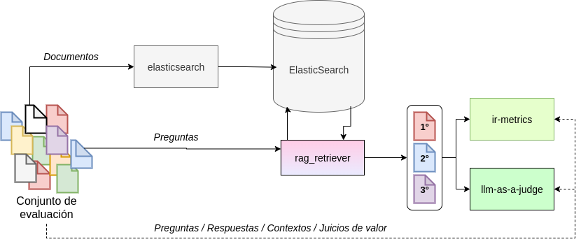

## Overview
The **Nós RAG Evaluation Tool** provides a framework to evaluate retrieval-augmented generation (RAG) systems, with a particular focus on the retrieval and reranking stages. It integrates multiple components to process queries, retrieve relevant contexts, and generate responses using metadata-rich datasets.

## Key Features
- **Dataset and Index Management**: Create evaluation datasets and manage Elasticsearch indices.  
- **Retrieval Evaluation**: Assess retrieval and reranking modules in RAG systems.  
- **Evaluation Metrics**:  
  - **Traditional IR Metrics**: Precision, Recall, and Mean Reciprocal Rank (MRR).  
  - **LLM-as-a-Judge**: Uses the `AtlaAI/Selene-1-Mini-Llama-3.1-8B` model to compute Context Precision and Context Recall.  
- **Visualization Tools**: Edit and visualize datasets for manual inspection.  

## Project Structure
- **datasets/**: Contains datasets used for evaluation.  
  - **News/**: Directory for news datasets.  
  - **Questions/**: Directory for question datasets.  
  - **Visualization_Tools/**: Tools for editing and visualizing datasets during manual revision.  
- **elasticsearch/**: Scripts for creating and managing Elasticsearch indices, including index configuration examples.  
- **ir-metrics/**: Implements traditional IR metrics for evaluation.  
- **llm-as-judge/**: Evaluation scripts using an LLM as a judge.  
- **rag_retriever/**: Implements the RAG system, including context retrieval and reranking logic. Stores experiment configurations.  
- **results/**: Stores evaluation outputs.  
- **utils/**: Utility functions for loading and processing datasets.  

Each directory includes scripts and configuration files with examples to facilitate reproducibility.

## System Flow

The following diagram illustrates the main workflow of the Nós RAG Evaluation Tool:



## Usage

### Prerequisites
- Python 3.9+  
- [Elasticsearch](https://www.elastic.co/elasticsearch/) running locally or remotely.
- Required Python dependencies (see `requirements.txt`)  

---

### 1. Create Elasticsearch Index
Make sure Elasticsearch is running, then create the index:  
```bash
sh launch_es_index_creation.sh
```

---

### 2. Configure the Experiment
Choose the configuration for your experiment, selecting the index, retrieval model, and reranker.  
Example configurations are available in:  
```
rag_retriever/configs/experiments/
```

---

### 3. Run Retrieval
Launch the retrieval process with the chosen configuration:  
```bash
sh launch_retrieval.sh
```

---

### 4. Evaluate Results
Evaluate the retrieved passages using:  

**Traditional IR metrics**  
```bash
sh launch_evaluate_ir_traditional.sh
```

**LLM-as-a-Judge**  
```bash
sh launch_llm_judge.sh
```

---

### 5. Aggregate Metrics
Summarize all evaluation results into a single report:  
```bash
sh launch_aggregate_metrics.sh
```